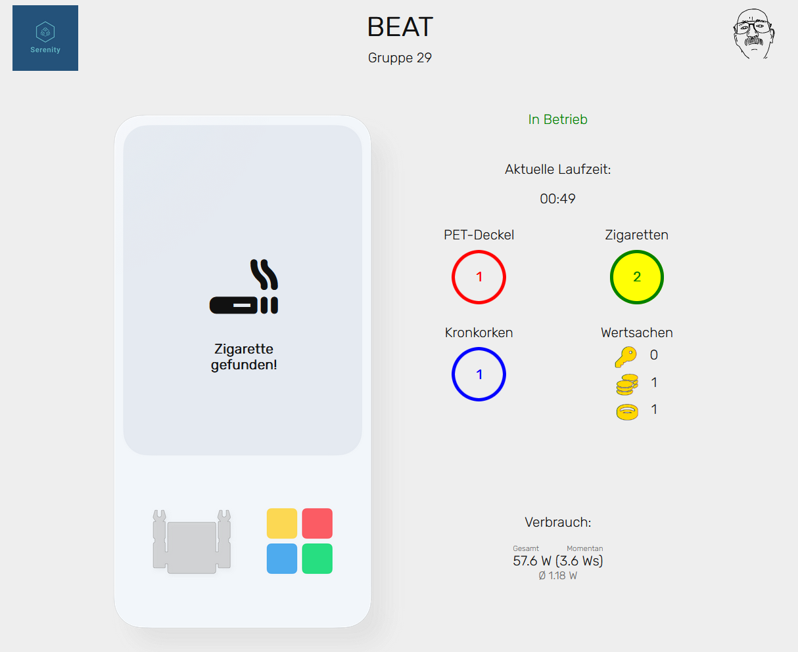

# beat-realtime-stats

## Description
Live-updating stats website as part of PREN lecture at HSLU HS22/FS23, where various recyclables our robot "BEAT" picks up are tracked.


## Components


## Setup
1. In Backend, do
```
npm install
```

2. run the sql script at backend/create_scripts/runs.sql in your local mysql installation

3. Create a ".env" file in backend and define the following environment variables (see backend/.env.sample):
```
AUTHORIZATION_TOKEN=<token the robot will use for authentication>
DB_HOST=<host name of the MySQL db, e.g. localhost>
DB_NAME=<name of the database, will probably be beat if you use create script>
DB_USER=<name of the db user>
DB_PASSWORD=<password of the db user>
```

## Usage
Start web server in /backend with

```
npm start
```

for dev (restarts on changes):

```
npm run dev
```
then open browser at specified location.

## API Documentation
### Open Endpoints

Open endpoints require no Authentication.

* Frontend : `GET /`
  * can be called from browser. Shows user interface.

### Endpoints that require Authentication

> :warning: Keep in mind that this authentication method is in no way to be considered safe. This application didn't run publically, so SSL encryption through HTTPS and WSS wasn't available to us.

Closed endpoints require a valid Token to be included in the authentication header of the
request. The token can be found in the .env file created during setup.

* Start run: `POST /start`
  * used to inform the backend that the robot has started searching for recyclables. Starts a new run 
  and starts timer at 00:00 in frontend.
* Stop run: `POST /stop`
  * used to inform the backend that the robot has stopped searching for recyclables. Stops the run
      and archives it in the database. Timer is stopped in frontend.
* Pass Found Object : `POST /foundObject`
  * Request Body Parameters: 
    * id: e.g. `{"id": 0}` - the id of the found object, for available ids see below
  * used to inform the backend that a recyclable object has been found. The following IDs for objects exist:
    * 0: beer bottle cap
    * 1: cigarette
    * 2: plastic bottle cap
    * 3: key
    * 4: coin
    * 5: ring
* Update amperage : `POST /amperage`
  * Request Body Parameters: 
    * amperage: e.g. `{"amperage": 0.4}` - the current amperage
  * Should be called every second. Takes the provided amperage and calculates current power 
  consumption with the constant voltage of 12 volts. The frontend is then updated, displaying the latest 
  and the overall power consumption in watt seconds.

## Authors and acknowledgment
- Samuel Nussbaumer
- David Decker